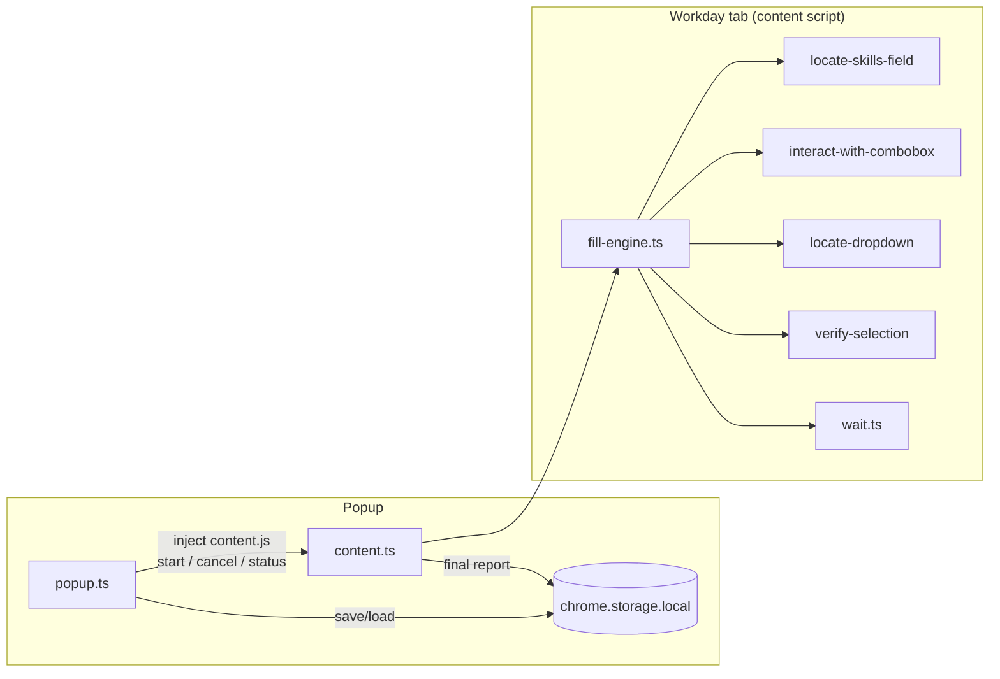

# SkillDock: Autofiller for Workday Skill Section

Selecting skills on Workday one by one sucks. This is a tool I built for
myself to help with my own applications. This is a chrome (Manifest V3)
extension that does one small job extremely reliably: it fills the
**Skills** section of a Workday job application from your saved skill list,
adding a skill **only when Workday's dropdown offers an exact match**.

> This project is an independent productivity tool and is not affiliated
> with, endorsed by, or sponsored by Workday, Inc. Workday is a trademark of
> its respective owner.

## The problem

Workday applications ask you to re-enter your skills through an autocomplete,
one at a time, on every single application. Doing that by hand is tedious.

## What it does

1. You save a skill list in the popup (one skill per line, stored locally).
2. On a Workday application's Skills step, click **Fill skills**.
3. The extension semantically locates the editable Skills autocomplete,
   skips skills that are already selected, then for each remaining skill:
   types the query, waits for Workday's suggestions, and selects an option
   **only if its text matches exactly** (same capitalization, punctuation,
   spacing, word order).
4. Every selection is **verified** against the selected-chip state before it
   is reported as added.
5. You get grouped results: **Added · Already present · No exact Workday
   match · Failed**.

It never selects an approximate match, never presses Next/Submit, never
touches other fields, and never sends data anywhere.

## Install (load unpacked)

```bash
npm install
npm run build      # emits the extension into ./dist
```

1. Open `chrome://extensions`.
2. Enable **Developer mode** (top right).
3. Click **Load unpacked** and select the `dist/` folder.

## Use

1. Click the SkillDock icon, enter your skills one per line, **Save skills**.
2. Open a Workday application and navigate to the step containing the
   **Skills** section (expand it if collapsed).
3. Click the SkillDock icon → **Fill skills**. You can close the popup; the
   run continues on the page. Reopen the popup for progress (`4 of 12`) or to
   press **Stop**.
4. If detection reports an ambiguous page, use **Pick field manually**, click
   the highlighted Skills input on the page, then press **Fill skills**.

## How exact matching works

All comparisons go through a single function, `isExactMatch`, which permits
only *display normalization*: Unicode NFC, non-breaking-space → space,
collapsing whitespace introduced by nested HTML, and trimming. Nothing else.
There is no fuzzy, substring, prefix, case-insensitive, synonym, or
"closest result" logic anywhere in the codebase, and the test suite proves
it (`Python` ≠ `Python Programming`, `C` ≠ `C++`, `AWS` ≠
`Amazon Web Services`, `PowerBI` ≠ `Power BI`, `Java` ≠ `JavaScript`, …).
A skill with no exact option is reported as **No exact Workday match** and
the run continues.

## Architecture

Two runtime components, no background worker, no frameworks, no runtime
dependencies:

- **Popup** (`src/popup/`): saves skills, injects the content script into
  the active tab (`activeTab` + `scripting`), starts/cancels runs, polls
  status. Stateless: closing it does not stop a run.
- **Content script** (`src/content.ts`): owns the run. It uses:
  - `workday/locate-skills-field.ts`: a **scored semantic locator**
    (accessible name, nearby headings, ARIA combobox semantics, Workday
    automation-id hints, chip presence) that accepts a field only when it
    clears a threshold *and* clearly beats the runner-up; otherwise it
    reports ambiguity instead of guessing.
  - `workday/interact-with-combobox.ts`: controlled-input adapter (native
    value setter + realistic events, character-by-character fallback).
  - `workday/locate-dropdown.ts`: resolves the suggestion listbox via
    `aria-controls`/`aria-owns`/`aria-activedescendant`, falling back to the
    single visible portal-mounted listbox; detects "no matches" states.
  - `workday/verify-selection.ts`: reads selected-skill chips scoped to the
    field's container and confirms selections by state diff, not by click.
  - `fill-engine.ts`: one sequential engine: bounded waits
    (`MutationObserver` + timeout + AbortSignal in `wait.ts`), bounded
    retries, per-skill structured results, rerender reacquisition.



**Build system:** esbuild via a 40-line script (`build.mjs`). The extension
has exactly two entry points and zero runtime dependencies, so a single
auditable script beats a plugin-driven bundler config; it emits plain IIFE
bundles that MV3 accepts directly.

## Permissions

| Permission | Why |
|---|---|
| `activeTab` | Grants access to the one tab you invoke the extension on, instead of broad host permissions for every `*.myworkdayjobs.com` shard. |
| `scripting` | Injects the content script into that tab on demand. |
| `storage` | Saves your skill list and the last run report locally. |

No host permissions, no history/cookies/downloads/clipboard/notifications/
identity/webRequest. See [PRIVACY.md](PRIVACY.md).

## Development

```bash
npm install
npm run typecheck   # strict TypeScript
npm run lint        # ESLint
npm test            # vitest (unit + integration, jsdom)
npm run build       # esbuild → dist/
npm run check       # all of the above
```

Tests cover skill-list normalization, the anti-fuzzy exact-match guarantees,
wait timeout/cancellation/cleanup, locator scoring across seven original
Workday-style fixtures, dropdown resolution (ARIA-linked, portal-mounted,
ambiguous), chip reading, and eleven integration scenarios that drive the
full engine against an interactive harness (delayed suggestions, delayed
chips, swallowed clicks, rerendered inputs, mid-run cancellation).

## Supported environment

Chromium-based browsers with Manifest V3 (Chrome 110+). Designed to support
multiple Workday tenant configurations through semantic field detection, with
graceful failure for unsupported layouts, see `docs/TEST-MATRIX.md` for what
has actually been verified.

## Known limitations

- Detection heuristics are English-first ("Skills", "Remove …",
  "No matches found"); non-English tenants may need the manual field picker
  and will time out rather than fast-fail on unmatched skills.
- Top-frame pages only; closed shadow roots are not (and will not be)
  bypassed.
- Workday can change tenant markup at any time; the locator degrades to
  reporting a clear failure rather than guessing.

## Troubleshooting

- **"No editable Workday Skills field was found"**: make sure you are on the
  application step that shows the Skills section and that it is expanded,
  then try again.
- **"More than one field looks like the Skills field"**: use **Pick field
  manually** and click the correct input.
- **"This page cannot be scripted"**: the active tab is a browser-internal
  page or blocked origin; switch to the Workday application tab first.
- **Skills report "timed-out"**: the tenant was slow to load suggestions;
  re-run for just the remaining skills (already-added ones are skipped).

## Why it's technically interesting

Dynamic-DOM synchronization without arbitrary sleeps, accessibility-driven
element detection with explicit ambiguity handling, controlled-React-input
interaction, strict exact autocomplete matching, state-diff selection
verification, rerender resilience, and a run lifecycle that survives the
popup closing, all with three permissions and zero runtime dependencies.

## License

MIT, see [LICENSE](LICENSE).
